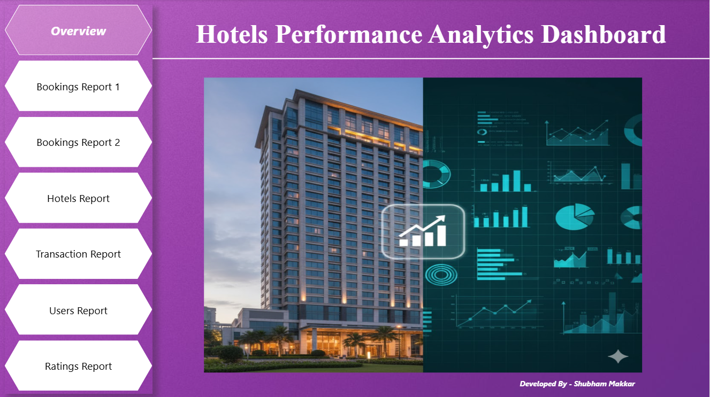

# 🏨 Hotels Analysis Project

### A complete hotel analytics project built using SQL and Power BI, covering bookings, revenue, occupancy, discount impact, rating patterns, and time-based performance insights.

---

## ⚙️ Project Workflow
1️⃣ SQL
- Generated all KPIs
- Calculated multiple analytical insights
- Performed month-wise, quarter-wise, and city-wise trends
- Implemented ranking, grouping, discount segmentation, running revenue, and MoM% change

2️⃣ Power BI
- Built dashboards for bookings, hotels, transactions, users, and ratings
- Applied DAX for Running Total, MoM%, Monthly Revenue, Quarterly Revenue
- Visualized insights using bar charts, line charts, map charts, tables, etc.
---

## 📊 Key Highlights
📦 **Bookings:** MOM% change in growth, city-wise total revenue & bookings count, peak booking months across all hotels  
🏨 **Hotels:** Hotel-wise occupancy rate, top 5 hotels by revenue, seasonal performance  
👤 **Users:** Top 5 loyal users, age group wise booking frequency, repeat users trend over time  
💳 **Transactions:** Payment mode preference, revenue distribution by payment mode, month-wise transaction success trend  
⭐ **Ratings:** Top 5 Hotels with highest ratings, rating trend over months, room type vs rating

---

## 🖥️ Power BI Dashboard Snapshots

Below are the key pages of Power BI report.  
Each page focuses on a different business area of Amazon’s E-commerce operations.

---

### 📊 Dashboard Overview

---

### 👥 Bookings Report  

---

### 📦 Orders Report  

---

### 🛍️ Products Report  

---

### 💳 Transactions Report  

---

### 🔁 Refunds Report  

---

### ⭐ Feedbacks Report  

---

> 📁 *Note: The `visuals` folder contains all 13 Power BI pages (1 overview + 12 detailed reports). Only the key pages are shown above for preview.*
